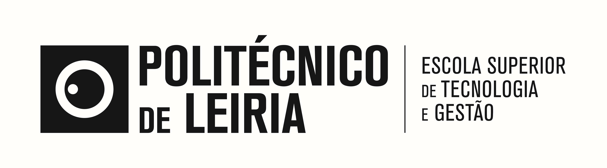
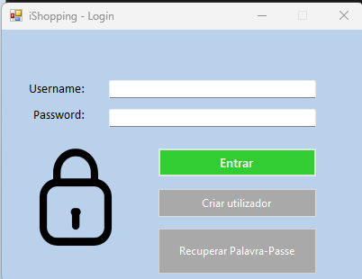
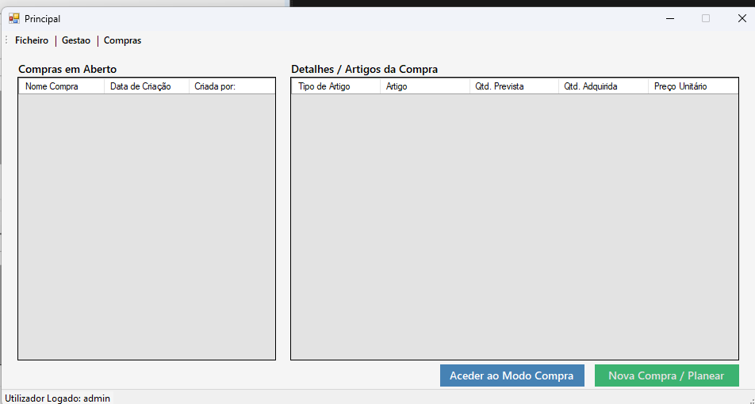
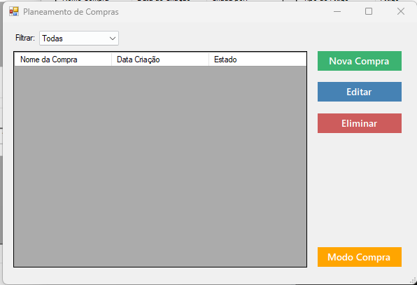
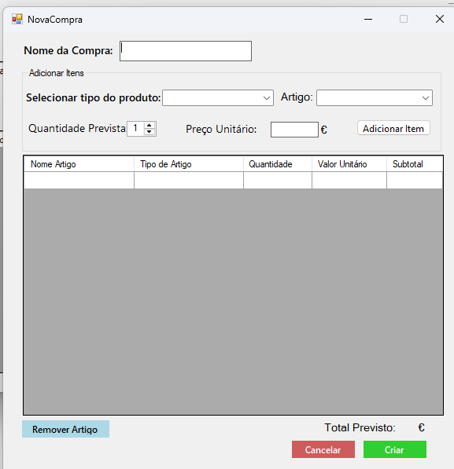
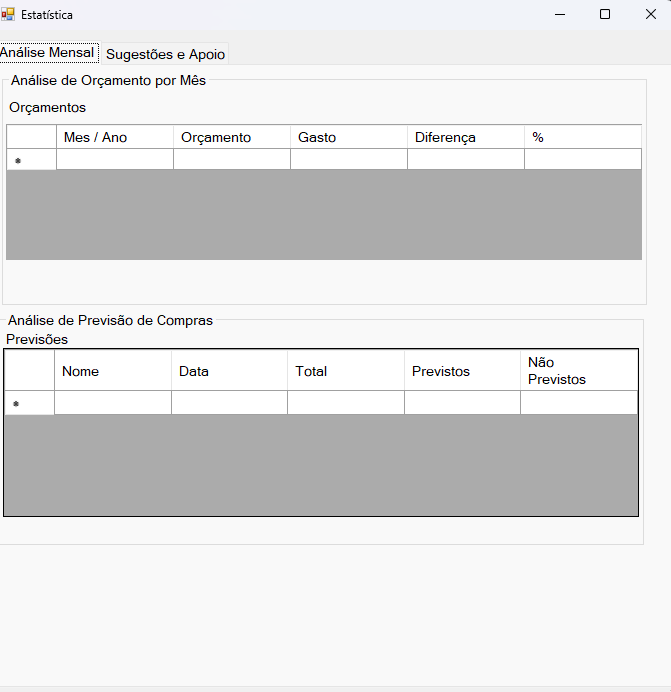
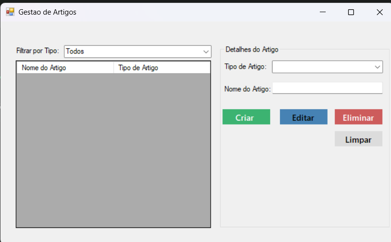
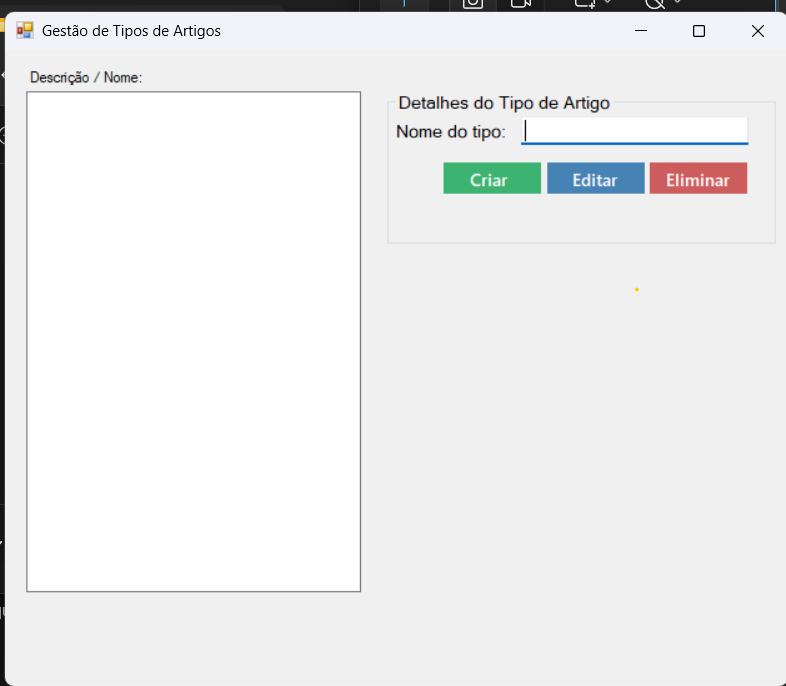
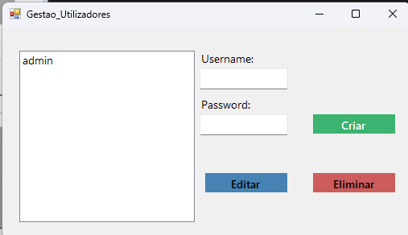

# iShopping 🛒

## 🏢 Instituição e Contexto
* **Instituição:** Instituto Politécnico de Leiria (IPL) - Politécnico de Leiria
* **Curso:** TeSP em Programação de Sistemas de Informação
* **Unidade Curricular:** Desenvolvimento de Aplicações (DA) & Metodologias de Desenvolvimento de Software (MDS)
* **Ano Letivo:** 2025/2026 | 1º Ano, 2º Semestre
* **Grupo:** PL-E

<!-- Logótipo oficial mapeado a partir da pasta img -->


## 👥 Equipa de Desenvolvimento
| Foto | Nome Completo | Número | Função no Scrum | GitHub |
| :---: | :--- | :---: | :--- | :--- |
| 🧑‍💻 | **Gustavo Biazini** | 2024100465 | Development Team | [@gustavobiazini](https://github.com/gustavobiazini) |
| 🧑‍💻 | **João Machado** | 2025166436 | Development Team | [@machado120](https://github.com/machado120) |
| 🧑‍💻 | **Valter Beca** | 2025162525 | Product Owner / Dev Team |[@ValterBeca] (https://github.com/ValterBeca) |

---

## 📝 Descrição do Projeto
O **iShopping** é uma aplicação Desktop desenvolvida em C# Windows Forms para mitigar a desorganização nas compras domésticas, centralizando o planeamento de listas, a execução física no supermercado e o controlo analítico de despesas.

### 🚀 Principais Funcionalidades (MDS)
* **Autenticação Segura:** Controlo de acessos individualizado para os utilizadores da casa.
* **Planeamento de Listas:** Criação estruturada de listas de compras e definição de quantidades previstas.
* **Modo Compra:** Interface interativa para carrinho de compras, calculando o total gasto em tempo real com preços reais.
* **Controlo de Orçamentos:** Definição de limites financeiros por compra com alertas visuais integrados.
* **Estatísticas de Consumo:** Relatórios analíticos de gastos totais agrupados por categorias de artigos.
* **Exportação:** Geração de ficheiros CSV para portabilidade de dados.

---

## 🛠️ Stack Tecnológica (DA)
* **Ambiente:** Windows Desktop (.NET Framework 4.7.2)
* **Linguagem:** C#
* **UI Architecture:** Windows Forms com padrão estrutural MVC (Model-View-Controller)
* **Persistência de Dados:** SQL Server LocalDB
* **ORM:** Entity Framework 6 (Code First)

---

## ⚙️ Engenharia de Software & Scrum
O projeto foi desenvolvido em **3 Sprints** de 2 semanas cada (entre 4 de maio e 15 de junho de 2026), utilizando o **Jira** para a gestão do Product Backlog, refinamento de User Stories e monitorização de Story Points.

---

## 🗂️ Elementos Técnicos do Sistema (DA)

<details>
<summary>📂 1. Credenciais Uniformes para Testes (Login)</summary>

Para testar as permissões e fluxos da aplicação sem necessidade de novos registos, utilize os seguintes dados configurados nativamente no *Seed* do Entity Framework:
* **Username:** `admin`
* **Password:** `admin123`

🔬 **Interface de Autenticação:**

</details>

<details>
<summary>🗄️ 2. Modelo de Dados e Entidades (EF6 Code First)</summary>

O modelo relacional gerado via Code First mapeia as seguintes entidades de negócio do ecossistema:
* `Utilizadores`: Dados de credenciais e parametrização de segurança.
* `Tipos_de_Artigos`: Categorias organizacionais dos produtos (ex: Laticínios, Limpeza).
* `Artigos`: Catálogo geral de produtos do sistema.
* `Compras`: Listas de compras e histórico de estados (Abertas / Fechadas).
* `Items`: Linhas associadas às compras contendo o mapeamento de quantidades (previstas vs. adquiridas) e preços finais.
* `Orcamentos`: Definição de limites financeiros.
</details>

<details>
<summary>📸 3. Demonstração Visual das Funcionalidades (Screenshots)</summary>

#### Dashboard / Menu Principal


#### Planeamento de Listas de Compras


#### Execução de Compras (Modo Compra)


#### Gestão e Controlo de Orçamentos


#### Painel Analítico de Estatísticas de Consumo


#### Módulos de Gestão e Parametrização Base
Aqui encontram-se as interfaces de suporte para a gestão de utilizadores e catalogação de artigos:
* **Gestão de Artigos:** 
* **Categorias (Tipos de Artigo):** 
* **Utilizadores do Sistema:** 
</details>

---

## 💻 Como Executar a Aplicação
1. Certifica-te de que tens o **Visual Studio 2022** e o **SQL Server LocalDB** instalados.
2. Clona o repositório oficial da equipa:
```bash
   git clone [https://github.com/machado120/DA_project.git](https://github.com/machado120/DA_project.git)